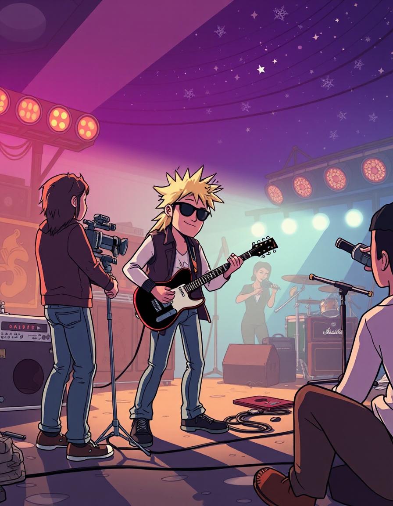

## Áudio
Aqui está o link para o arquivo de áudio:
[Ouvir 1231.MP3](output/1231.MP3)

## Imagem
Aqui está a imagem:

# Projeto Podcast Gerado por I.A.s

 > ℹ️ **NOTE:** Este é o repositório desenvolvido durante uma live no Youtube em parceria com a [DIO](https://dio.me)

## 💻 Tecnologias utilizadas no projeto

- [ChatGPT](https://chat.openai.com/) 
- [lazypy](https://lazypy.ro/tts/)
- [Mage](https://www.mage.space/)
- [Capcut](https://www.capcut.com/pt-br/)

## ✨ Como foi feito ?

- Roteiro gerado via chatgpt
- Audio gerado pela lazypy
- Capcut para tratar aúdio e adicionar sons de fundo
